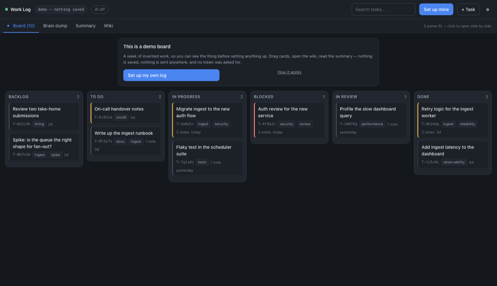
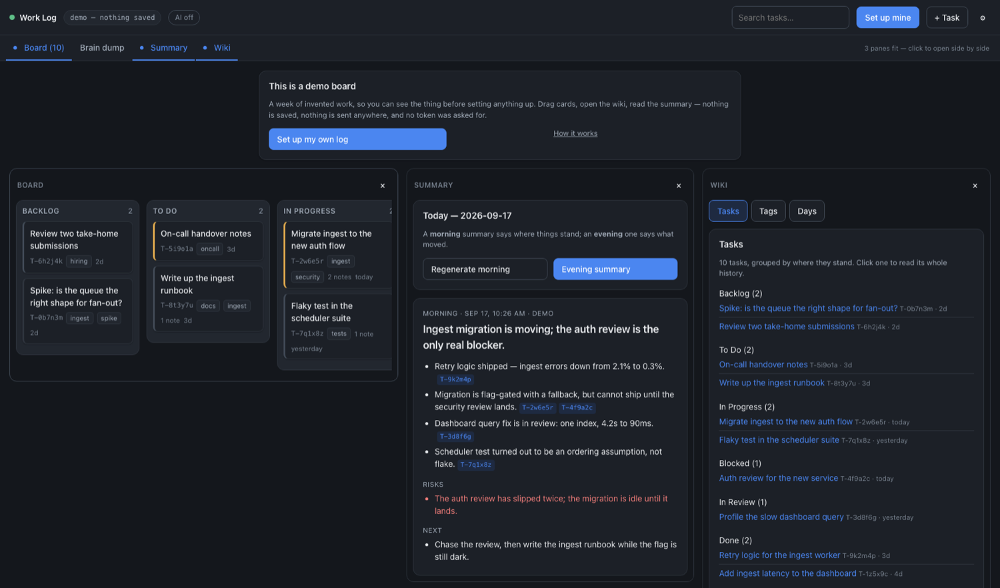
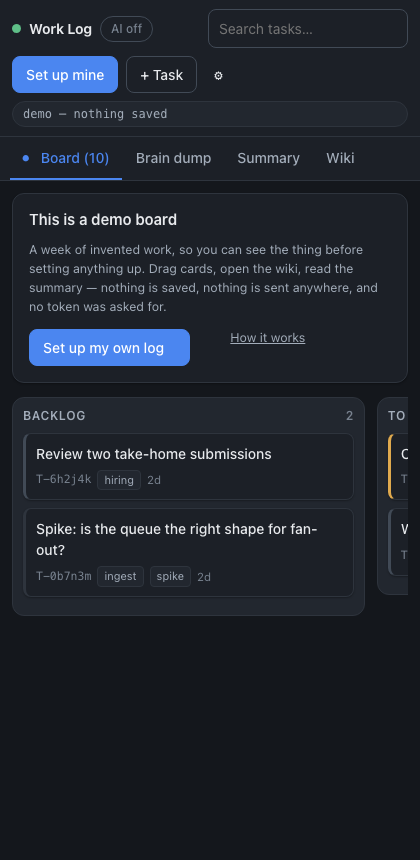

# Work Log

A JIRA-style board for your own work, backed by an append-only event log in a git repo you own.
No build step, no server, no database — plain ES modules served straight off GitHub Pages. Nothing
is installed and nothing is bundled; the one exception is the in-browser WebGPU tier, which pulls
the WebLLM runtime from a CDN the first time you use it.

**[Try the demo](https://tanmayagrawal21.github.io/worklog/?demo=1)** — sample data, no token, nothing
saved. **[Live app](https://tanmayagrawal21.github.io/worklog/)** when you want your own.

The point is the changelog. Every change you make is an event committed to *your* repo, so
`git log -p` on it reads as a legible history of what you actually did — and an optional AI pass
turns that history into a two-line executive summary each morning and evening.



The views are panes, not tabs: on a wide screen you open the board, the summary and the wiki beside
each other, which is what the daily loop actually wants. A layout is shareable — `?panes=board,summary,wiki`
is the link that produced this.



Down to about 400px it stays usable: the header wraps, panes collapse to one, and the columns scroll
sideways.



## The daily loop

Setup is two things — a repo to keep your log in and a GitHub token so the app can write to it —
and [SETUP.md](SETUP.md) walks both in about two minutes. The [demo board](https://tanmayagrawal21.github.io/worklog/?demo=1)
is there if you want to see the loop running first; it is the same code over invented data, with a
built-in interpreter standing in for the model, so the brain dump and the summary work there too.

1. Open the app. Read the morning summary of where things stand.
2. Either **drag cards** on the board, or **brain-dump a paragraph** and let the AI propose
   changes — every proposal comes with a checkbox, and nothing is applied until you check it.
3. At end of day, brain-dump again and take the evening summary.
4. Hit **Publish**. You see the exact commit message and file list *before* anything is pushed.

Alongside the board there's a **wiki** view: one page per task with its whole history, pages per
tag, and a dated journal page per day. Task ids written in notes (`blocked by T-4f9a2c`, or
`[[T-4f9a2c]]`) become real links, so notes accumulate into a connected record.

## AI is a choice, and "none" is one of them

Pick a tier in Settings. The default is the first one — until you choose otherwise, your log goes
to your own repo and nowhere else.

| Tier | What runs | What leaves your machine |
| --- | --- | --- |
| **No AI** | nothing | nothing — it's a board and a changelog |
| **On my machine** | WebLLM on your GPU in this browser, or Ollama / llama.cpp / LM Studio locally | nothing |
| **Open models in the cloud** | Hugging Face inference | task titles (see below) |
| **A commercial or custom API** | OpenAI, Anthropic, Google, OpenRouter, or any OpenAI-compatible endpoint | task titles (see below) |

For the two cloud tiers: any task you flag **private** is never included in a request, and a
global *"titles only, never notes"* toggle withholds note text from every request. Requests
negotiate down through `json_schema` → `json_object` → plain prompting, and drop sampling
parameters an endpoint rejects, so gateways with narrow parameter support still work.

## Privacy model

- **Your data repo can be private.** Confidentiality is GitHub's repo visibility setting, enforced
  server-side — not client-side encryption. The app reads and writes it with *your* token.
- **This app repo is public and holds no data.** Pages on a Free plan cannot serve a private repo,
  so the app is public; nothing of yours is in it.
- **Tokens never leave your browser.** They live in `localStorage`, never in any commit, and can be
  locked behind a passphrase (PBKDF2-SHA256, 600k iterations → AES-GCM). AI keys are stored per
  provider.
- **You approve every push.** No write to your repo happens without the preview dialog first.

Caveats worth reading before you trust it with anything sensitive:

1. Task JSON is **plain text** in your repo. That is deliberate — it's what makes `git diff`
   readable — but a private repo later flipped to public exposes its entire history.
2. On the cloud tiers, board content reaches a third-party inference provider. The `private` flag
   and the notes toggle are the mitigations; they are in Settings, not buried.
3. The passphrase lock uses PBKDF2 rather than Argon2id because that is what WebCrypto offers. The
   iteration count is stored with the record so it can be raised later.

## Getting started

Use the hosted app and point it at your own repo — see [SETUP.md](SETUP.md). If you don't have a
data repo yet, the first-run wizard offers to create one and asks whether it should be public or
private.

## Deploy your own copy

Nothing here is tied to my account: the app reads its own URL at runtime and every asset path is
relative, so a copy works unchanged wherever it is served from.

1. **Use this template** (or fork it) into a repo of your own.
2. Settings → Pages → Source: *Deploy from a branch*, `main`, `/ (root)`.
3. Wait for the first build; your copy is at `https://<you>.github.io/<repo>/`.

That's it — no configuration step, no secrets, no Actions. Your copy writes *its own* URL into the
data repos it sets up, and `scripts/setup.sh` picks the URL up from the git remote for the same
reason. Worth doing if you'd rather your team not depend on a Pages site under someone else's
account, and it's the only option if you want to pin a version.

The app repo has to be public for Pages to serve it on a Free plan. That costs nothing in privacy:
it contains no data and no tokens, and your log lives in a separate repo that can be private.

## Running it locally

There is nothing to install and nothing to build.

```sh
git clone https://github.com/tanmayagrawal21/worklog.git
cd worklog
python3 -m http.server 8000
# open http://localhost:8000
```

It must be served over HTTP rather than opened as a `file://` URL, because it loads ES modules.
Any static server does — `caddy file-server`, `npx serve`, whatever you have.

If you have Node and would rather not clone anything, the app also runs as one npm command:

```sh
npx work-log          # serves it and opens a browser
npx work-log --demo   # the sample board, no token, nothing saved
```

*Not on npm yet — the package is here and works, but the first `npm publish` has not happened. From
a checkout, `node bin/worklog.mjs` is the same thing. Delete this note once it is published.*

That is a static file server over the package's own directory and nothing else — no build, no
dependencies, no telemetry, nothing written outside your data repo. `npx work-log --help` lists the
handful of flags (`--port`, `--host`, `--no-open`). Useful if you want a pinned version, or if your
laptop is where you'd rather the AI keys live; note that a browser will not reach a `localhost`
inference server *from* a `https://` page, so the local-model tier is easier this way round.

## How your data repo is laid out

Written so that it reads well on GitHub with no tooling at all: every JSON file has a rendered
`.md` sibling, and clicking any `.md` on GitHub renders it — private repos included.

```
data/manifest.json        which months exist, counts, schema version
data/board.json           snapshot of the current board + `through` marker
data/BOARD.md             the same board, rendered
data/log/README.md        index of the whole log
data/log/2026/README.md   index of that year
data/log/2026/09/…        one month of events: 09.json + 09.md
CHANGELOG.md              small index, not a growing wall of text
```

Two design decisions carry the weight. The event log is the source of truth — the board is
`fold(events)`, and merging two machines is a **union by event id** re-sorted by `(ts, id)`, so it's
order-independent and idempotent. And events and snapshot tasks serialise **one record per line**,
so one change is one added line in `git log -p`, and files stay under GitHub's 20,000-line diff
limit for decades. Boot reads the manifest, the snapshot, and about three months — not every month
you have ever logged, so year five opens as fast as week one.

**Dates are yours, timestamps are UTC.** Every event stores a UTC instant, because that is the only
thing two machines agree on and the only thing that sorts. But the day a piece of work belongs to is
your local one: day headings, month filing and the times in the rendered pages are all local, and
each month page says which offset it was generated in. Otherwise an evening in Tucson lands on
tomorrow, which is where this started.

Repos written by the earlier flat layout still load, and the app offers a one-commit upgrade
(behind the same preview-and-confirm gate as any other push).

## Tests

```sh
./scripts/test.sh
```

99 assertions across store, ai, dom, providers, and github — run under JavaScriptCore, which ships
with macOS, so there are no dev dependencies either. Any ES-module runtime works:
`JSC=$(which node) ./scripts/test.sh` needs `--experimental-vm-modules` on older Node.

## Where things are

| Path | Role |
| --- | --- |
| [js/store.js](js/store.js) | events, fold, union-merge, snapshot + markdown rendering, staging, push |
| [js/github.js](js/github.js) | contents + Git Data API, atomic multi-file commits, conflict detection |
| [js/ai.js](js/ai.js) | request negotiation, `proposeOperations`, `sanitiseOperations`, `summarise` |
| [js/providers.js](js/providers.js) | the provider catalogue behind the four tiers |
| [js/vault.js](js/vault.js) | token storage and the optional passphrase lock |
| [js/bootstrap.js](js/bootstrap.js) | inspecting a repo and scaffolding a new one |
| [js/ui/](js/ui/) | board, brain dump, summary, wiki, settings, setup wizard, DOM helpers |
| [js/webllm.js](js/webllm.js) | the in-browser WebGPU path |
| [js/demo.js](js/demo.js) | the sample board behind `?demo=1`, read through the real Store |
| [test/](test/) | headless suites and the JSC shim |
| [scripts/](scripts/) | the test runner, and the CLI path for seeding a data repo |
| [bin/worklog.mjs](bin/worklog.mjs) | the `npx work-log` static server: zero dependencies, ~150 lines |

Model output is treated as untrusted: `sanitiseOperations` drops hallucinated task ids, bad enums,
and no-op edits before anything reaches the board. All UI text goes through `textContent` — there is
no HTML string templating anywhere, so a note containing markup stays text.
